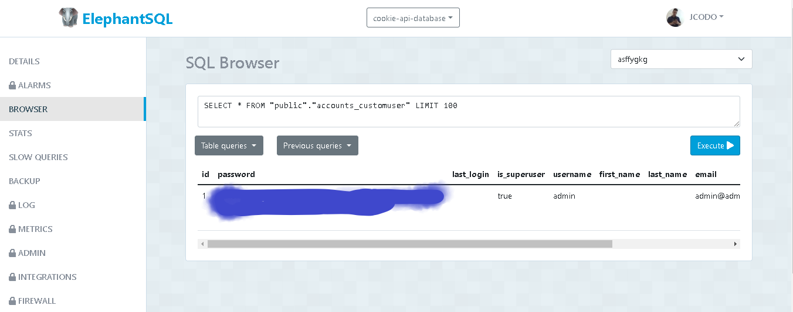
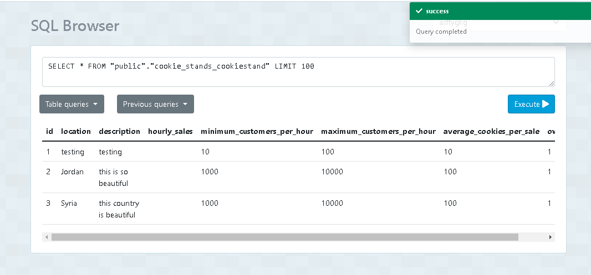
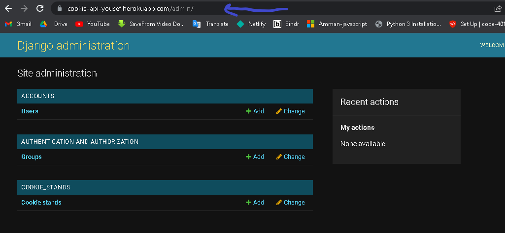
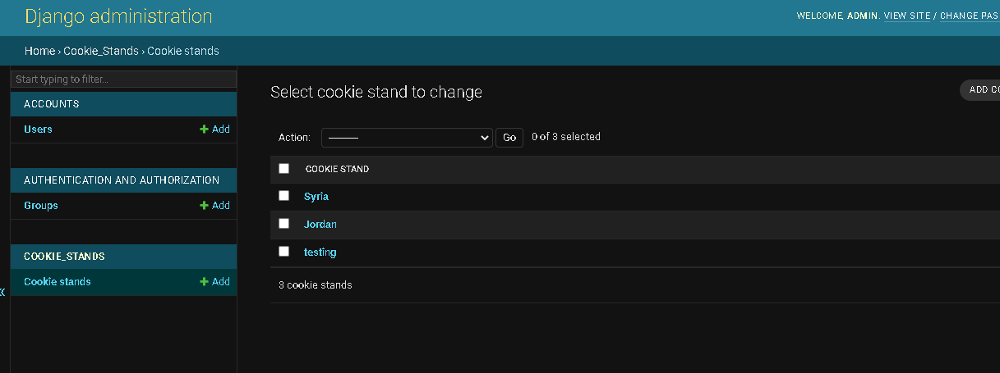
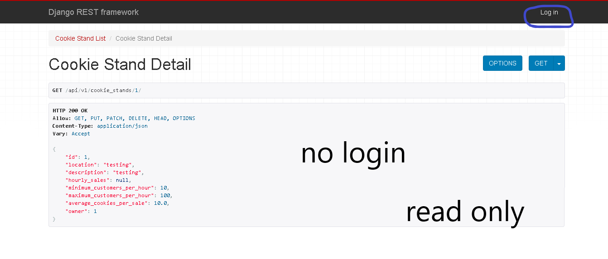
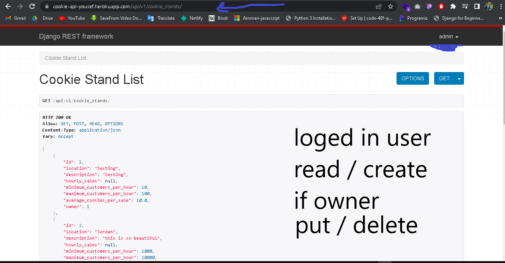
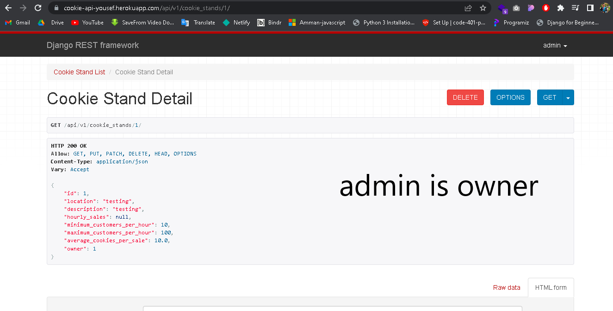
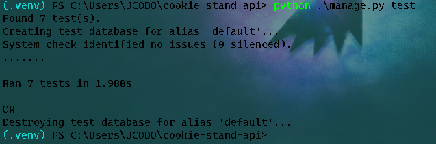

# LAB 34 Django REST Framework Authentication & Production Server

> use for login `username:admin`   and   `password:admin`

> Run `git push heroku main` and go to the admin panel `https://cookie-api-yousef.herokuapp.com/admin/`

> home page `https://cookie-api-yousef.herokuapp.com/api/v1/cookie_stands/`

> details page try `https://cookie-api-yousef.herokuapp.com/api/v1/cookie_stands/1/`

> Elephant sql Link: `https://api.elephantsql.com/console/7f71eb6f-1db2-49d7-849b-8ebbfcf6d97e/browser?#`

> Deployed URL `https://cookie-api-yousef.herokuapp.com/`
- add after base url `api/v1/cookie_stands` to see the cookie stand list

> Some Images for stages

